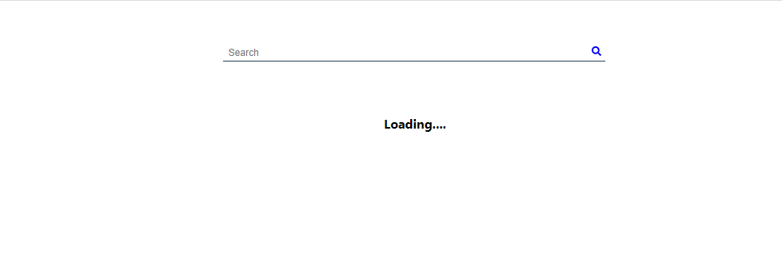
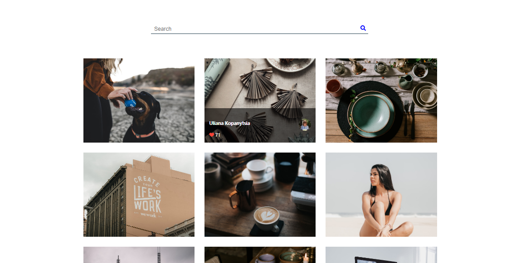

# Stock-Photos

Completed another react project that display stock image or photo to 
the browser. I was able to implement the infinite scroll on this project.
There is also a search form through which one can search for any kind of photo 
and a collection of this photo will be display to the browser. The Stock photo are obtain
through the Unsplash() API call. below are pictures of how web app is rendered. 

# Desktop View 

# Mobile View 

      